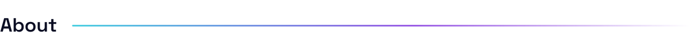
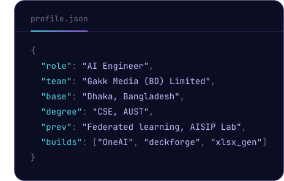
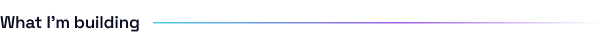
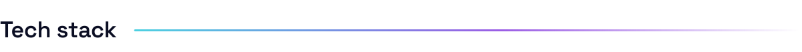
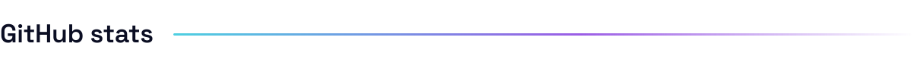
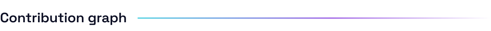
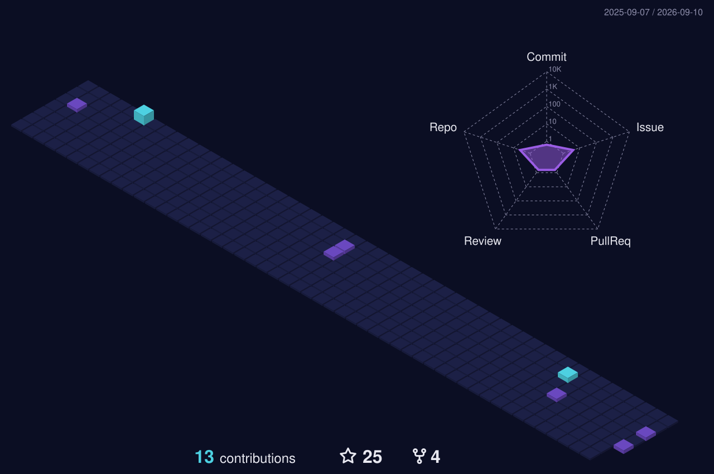
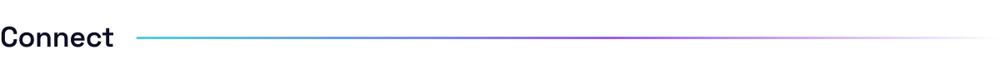
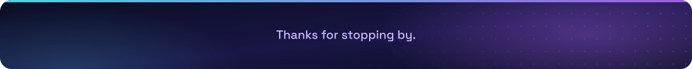

<picture>
  <source media="(max-width: 600px)" srcset="assets/hero-mobile.svg">
  
</picture>

  &nbsp;
  

  

 

<picture>
  <source media="(prefers-color-scheme: dark) and (max-width: 600px)" srcset="assets/heading-about-dark-mobile.svg">
  <source media="(prefers-color-scheme: dark)" srcset="assets/heading-about-dark.svg">
  <source media="(max-width: 600px)" srcset="assets/heading-about-light-mobile.svg">
  
</picture>

AI Engineer at **Gakk Media (BD) Limited** in Dhaka. Building **OneAI**, a self-hosted multi-LLM platform that puts GPT, Claude, Gemini, Grok, DeepSeek and open-source models behind one API, at a fraction of the cost of paying for each one separately.

Before that, I was making AI system, ML models, federated learning and edge-fog-cloud systems at **AISIP Lab**, with a detour building OTT streaming backends. CSE graduate of **Ahsanullah University of Science & Technology**.

I mostly write systems that turn a sentence into something real: a slide deck, a spreadsheet, a document, a retrieved answer! Then I spend an unreasonable amount of time making sure the output doesn't quietly lie to the renderer.

 

<picture>
  <source media="(prefers-color-scheme: dark) and (max-width: 600px)" srcset="assets/heading-building-dark-mobile.svg">
  <source media="(prefers-color-scheme: dark)" srcset="assets/heading-building-dark.svg">
  <source media="(max-width: 600px)" srcset="assets/heading-building-light-mobile.svg">
  
</picture>

<table>
<tr>
<td width="50%" valign="top">

### 🧠 OneAI &nbsp;<code>ai-hub-api</code>

Bangladesh's first self-hosted multi-LLM hub. Search-augmented chat over SSE, tiered scraping, and a Redis-backed context system that auto-summarizes at 65% of the token budget before hard-truncating at 88%.

  

</td>
<td width="50%" valign="top">

### 🔍 oneai-search

A production-grade AI search and scraping service built on SearXNG, rotating proxy pools, and tiered extraction (Trafilatura + Crawl4AI). Decoupled into its own vertical-slice service with Postgres-backed caching and isolated browser workers.

  

</td>
</tr>
<tr>
<td width="50%" valign="top">

### 📽️ deckforge &nbsp;<code>pptx_gen</code>

A spec-driven PowerPoint engine. An LLM emits a content-only `DeckSpec`, and everything about how the deck _looks_ (palette, typography, composition, icons) is decided downstream by code, not the model.

  

</td>
<td width="50%" valign="top">

### 📊 xlsx_gen

The same architecture for spreadsheets. Natural language becomes a `WorkbookSpec` JSON, resolved by a deterministic `openpyxl` renderer into live formulas and native charts.

  

</td>
</tr>
<tr>
<td width="50%" valign="top">

### 🗂️ Document extraction registry

A unified extraction layer for RAG (PDF / DOCX / XLSX / Images), with automatic script detection routing pages to the right OCR model: Bengali, Arabic, Devanagari, CJK, Latin.

 

</td>
<td width="50%" valign="top">

### 📰 Bangladesh news RAG

A news retrieval pipeline built on BGE-M3 embeddings and Qdrant hybrid dense+sparse retrieval with RRF fusion, validated end-to-end with RAGAS.

  

</td>
</tr>
</table>

 

<picture>
  <source media="(prefers-color-scheme: dark) and (max-width: 600px)" srcset="assets/heading-stack-dark-mobile.svg">
  <source media="(prefers-color-scheme: dark)" srcset="assets/heading-stack-dark.svg">
  <source media="(max-width: 600px)" srcset="assets/heading-stack-light-mobile.svg">
  
</picture>

<table>
<tr>
<td align="right" width="190"><b>AI / ML</b></td>
<td></td>
</tr>
<tr>
<td align="right"><b>Infrastructure</b></td>
<td></td>
</tr>
<tr>
<td align="right"><b>Data &amp; storage</b></td>
<td></td>
</tr>
<tr>
<td align="right"><b>Full-stack</b></td>
<td></td>
</tr>
<tr>
<td align="right"><b>Languages</b></td>
<td></td>
</tr>
<tr>
<td align="right" valign="top"><b>LLM &amp; agents</b></td>
<td>

</td>
</tr>
</table>

 

<picture>
  <source media="(prefers-color-scheme: dark) and (max-width: 600px)" srcset="assets/heading-stats-dark-mobile.svg">
  <source media="(prefers-color-scheme: dark)" srcset="assets/heading-stats-dark.svg">
  <source media="(max-width: 600px)" srcset="assets/heading-stats-light-mobile.svg">
  
</picture>

  
  

  

 

<picture>
  <source media="(prefers-color-scheme: dark) and (max-width: 600px)" srcset="assets/heading-activity-dark-mobile.svg">
  <source media="(prefers-color-scheme: dark)" srcset="assets/heading-activity-dark.svg">
  <source media="(max-width: 600px)" srcset="assets/heading-activity-light-mobile.svg">
  
</picture>

  

  

 

<!-- <picture>
  <source media="(prefers-color-scheme: dark) and (max-width: 600px)" srcset="assets/heading-connect-dark-mobile.svg">
  <source media="(prefers-color-scheme: dark)" srcset="assets/heading-connect-dark.svg">
  <source media="(max-width: 600px)" srcset="assets/heading-connect-light-mobile.svg">
  
</picture>

  &nbsp;
  

  -->

<picture>
  <source media="(max-width: 600px)" srcset="assets/footer-mobile.svg">
  
</picture>
